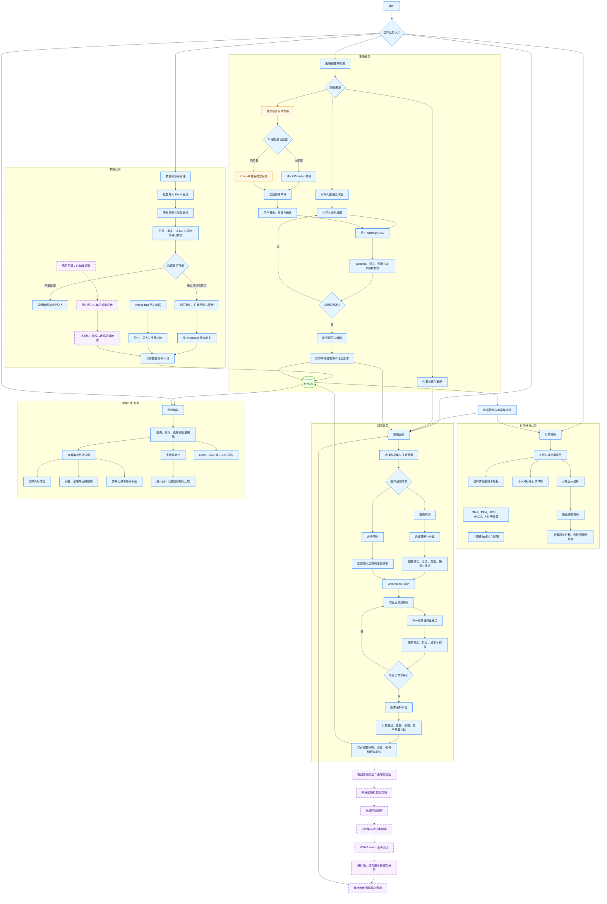
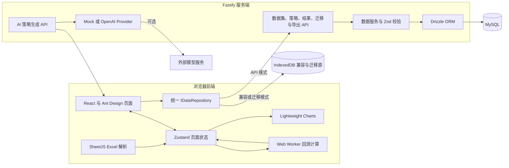
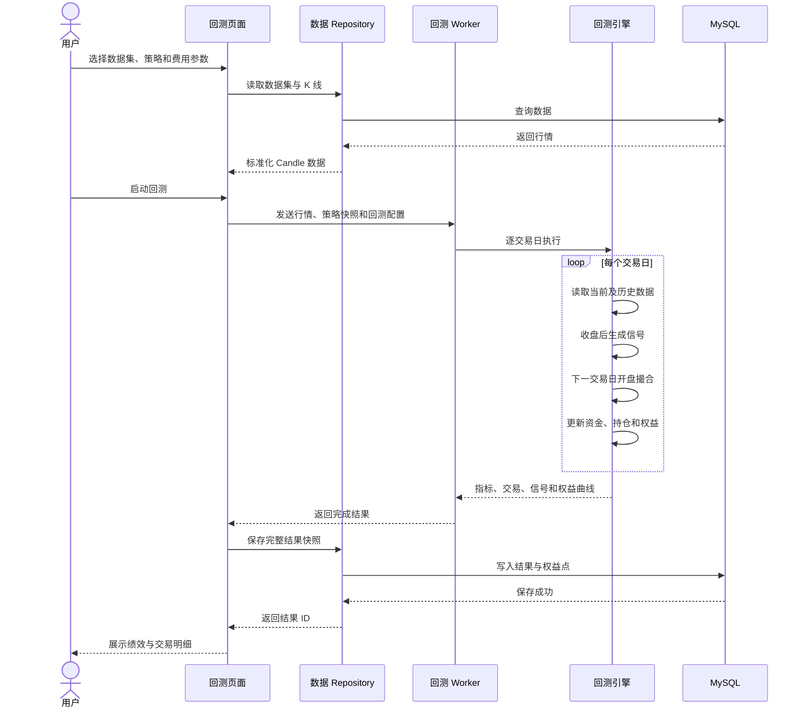
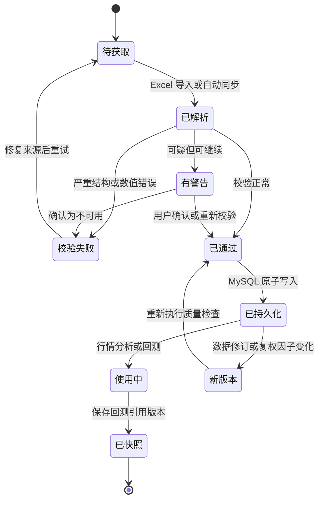
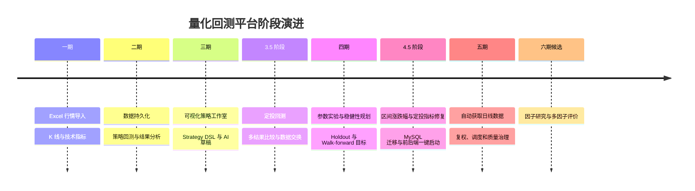

# 量化回测项目总览与业务流程

## 1. 项目定位

本项目是面向日频、单标的、只做多研究场景的量化分析与策略回测平台。当前业务主线已经从早期的浏览器本地工具，演进为“React 前端 + Fastify 服务端 + MySQL 持久化 + Web Worker 计算”的本地全栈应用。

系统围绕以下闭环建设：

```text
获得并治理行情数据
        ↓
行情与技术指标分析
        ↓
创建或选择交易策略
        ↓
配置并运行回测
        ↓
分析、比较和保存结果
        ↓
参数研究与样本外验证
        ↓
形成可复现的策略研究结论
```

## 2. 完整业务流程图

图例：蓝色为当前仓库已实现能力，橙色为可选外部能力，紫色为后续规划能力。



## 3. 当前系统架构与数据流



架构原则：

- 页面通过统一 Repository 访问数据，不直接依赖 MySQL；
- 回测核心仍在浏览器 Web Worker 中运行，服务端负责持久化与 AI 接口；
- MySQL 不可用时服务端数据接口返回明确错误，不应静默产生数据分叉；
- AI 只生成受限 Strategy DSL 草稿，不能直接执行任意代码或自动运行回测；
- 数据集、策略版本、回测配置和结果快照共同保证研究可复现。

## 4. 当前业务模块总览

| 业务域 | 当前能力 | 主要输入 | 主要输出 | 状态 |
| --- | --- | --- | --- | --- |
| 数据导入 | Excel 批量导入、字段映射、校验、去重 | `.xlsx` 日线文件 | 标准化 `Candle[]` | 已实现 |
| 数据管理 | 保存、查询、打开、删除、导出与迁移 | 数据集和 K 线 | MySQL 数据集 | 已实现 |
| 行情分析 | K 线、成交量、指标、十字光标、区间涨跌幅 | 行情数据 | 图表与区间结果 | 已实现 |
| 技术指标 | 11 类常用指标及参数编辑 | `Candle[]`、指标参数 | 指标序列 | 已实现 |
| 内置策略 | 双均线、RSI、MACD、BOLL | 行情和策略参数 | 买卖信号 | 已实现 |
| 可视化策略 | DSL、节点编辑、校验、草稿和版本 | 用户规则 | Strategy DSL 版本 | 已实现 |
| AI 策略 | 生成、修改和解释策略草稿 | 自然语言提示词 | 受限 DSL 草稿 | 可选配置 |
| 策略回测 | 信号、撮合、仓位、费用、滑点和强平 | 数据集、策略、配置 | 交易和权益曲线 | 已实现 |
| 定投回测 | 周期投入、现金流净值和定投绩效 | 数据集、金额、频率 | 定投结果 | 已实现 |
| 结果分析 | 指标、明细、权益曲线、基准和多结果比较 | 历史回测结果 | 分析报告 | 已实现 |
| 数据迁移 | IndexedDB 导出、MySQL 导入和核对 | 浏览器历史数据 | MySQL 数据 | 初步实现 |
| 参数实验 | 网格/随机搜索、Holdout、Walk-forward | 策略参数空间 | 稳健候选参数 | 规划目标，当前代码未见完整入口 |
| 自动数据 | 历史回补、增量同步、复权和质量治理 | 外部行情源 | 版本化行情数据 | 第五阶段规划 |
| 因子研究 | IC、分层、中性化和多因子合成 | 截面行情和财务数据 | 因子报告 | 第六阶段候选 |

## 5. 策略回测核心时序



## 6. 数据生命周期



## 7. 项目阶段演进



## 8. 当前边界与风险

- 当前主要面向日频、单标的、只做多研究，不等同于真实交易系统；
- 回测使用收盘信号、下一交易日开盘成交，未完整模拟涨跌停、停牌、流动性和冲击成本；
- AI 生成内容必须经过 DSL 校验、人工确认和本地回测，不能视为投资建议；
- 第四阶段文档描述的批量实验和 Walk-forward 尚需与当前代码入口重新核对并完成接入；
- README 仍包含“默认使用 IndexedDB”和旧结果数量限制等过时描述，应在 4.5 阶段收口时更新；
- 自动数据上线前必须明确数据授权、复权口径、交易日历和异常修订规则；
- 因子研究开始前，应先确保自动数据链路稳定并具备时点化、版本化能力。

## 9. 建议的用户主路径

1. 在“数据管理”中导入 Excel，或在第五阶段通过自动数据源同步行情；
2. 查看数据校验、来源、日期范围和质量状态；
3. 打开“行情分析”，添加指标并使用蓝线区间工具观察阶段表现；
4. 选择内置策略，或在“策略工作室”创建并发布可视化策略；
5. 在“策略回测”中设置资金、费用、滑点和运行区间；
6. 运行回测并在“回测结果”中检查收益、回撤、交易和权益曲线；
7. 将多个结果放在相同基准下比较，淘汰样本少、回撤大或表现不稳定的方案；
8. 待策略实验室完整接入后，再执行参数搜索、样本外验证和 Walk-forward；
9. 保存策略版本、数据版本和回测配置，形成可重复验证的研究记录。
