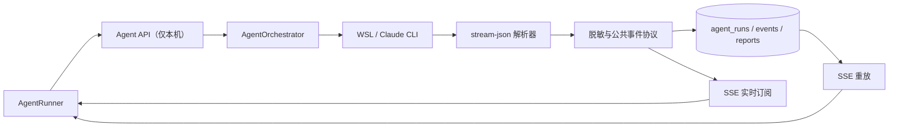

# 智能体系统设计（v2）

> 状态：已实施
> 更新日期：2026-08-10
> 适用范围：智能体对话、事件流、历史记录、进程编排和 HTML 报告

## 1. 设计目标

系统把模型供应商的原始流转换为面向产品的公共事件。API、数据库公共字段和前端 DOM 不保存、不传输、不渲染模型的原始思维链。普通对话与报告生成相互独立；用户只有显式打开“生成 HTML 报告”时，本轮才允许写报告。

## 2. 组件与数据流



- `outputParser.ts`：一条 JSONL 输入转换为 0～N 个公共事件；启用 partial messages，将思考块开始事件实时替换为不含原文的通用分析进度；支持嵌套工具结果和错误变体。
- `eventProtocol.ts`：公共类型、长度限制、凭据/连接串/绝对路径脱敏。
- `agentOrchestrator.ts`：并发占位、进程树生命周期、事件串行落库、超时和唯一终态。默认在项目的 `tmp_output` 中启动 Claude Code，并按产品配置传入 `--dangerously-skip-permissions`。
- `agentRepository.ts`：条件状态迁移、唯一序号、对话与事件分页、重启恢复。
- `routes/agent.ts`：本机访问边界、SSE 先订阅后重放、v1 历史适配、报告隔离响应。

权限说明：`tmp_output` 是默认工作目录和提示词规定的操作边界，但 `--dangerously-skip-permissions` 本身不提供文件系统沙箱。当前 WSL 用户在操作系统层面可访问的其他路径，技术上仍可能被访问；需要硬隔离时应改用容器、专用 WSL 用户或挂载命名空间。

## 3. 公共事件协议

协议版本为 `agent-events-v2`，SSE 响应通过 `X-Agent-Event-Protocol` 声明。

```ts
type AgentEventType =
  | 'progress'
  | 'tool_started'
  | 'tool_finished'
  | 'assistant_text'
  | 'assistant_final'
  | 'confirmation_required'
  | 'error'
  | 'terminal';
```

事件包含 `runId`、`seq`、`type`、`timestamp` 和 `publicContent`。工具事件可包含 `toolName`、`toolUseId`、`durationMs`；终态事件必须包含真实的 `status`、`exitCode` 和可选 `errorCode`。

规则：

- 同一 run 的 `seq` 严格递增，数据库以 `UNIQUE(run_id, seq)` 防止重复。
- `terminal` 是唯一结束信号，且先持久化、后推送。
- 工具输入和原始输出不写入 v2 的旧 `tool_input/tool_result` 字段。
- v1 `thought` 仍保留在迁移前备份与旧库中，但任何读取接口都默认隐藏。
- v1 中间文本经过脱敏后映射为 `progress`，每轮最后文本映射为 `assistant_final`。
- SSE 建连后立即发送注释帧并进入运行态；首个模型事件到达前显示“正在分析任务”和动态已处理时长，避免长任务停留在“连接中”。
- SSE 使用原始响应流时显式回写受限的 loopback CORS 来源；前端 `127.0.0.1` 与 API `localhost` 端口不同也能持续接收实时事件。
- 前端以 `(runId, seq)` 去重，避免多轮会话中相同序号互相覆盖；收到完成终态后主动对账最终事件和报告，因此无需刷新浏览器才能看到产物。
- 需要用户决策时，Agent 在最终回答附带受限的 `agent-confirmation` JSON；解析器将其转换为 `confirmation_required`，前端显示最多 4 题的确认卡，提交后作为同一 conversation 的下一回合继续。历史卡片一旦已有后续用户消息即锁定。

## 4. 状态机与进程生命周期

```text
pending -> starting -> running -> completed
   |          |          |-----> failed
   |          |          `-----> canceled
   |          `----------------> failed
   `---------------------------> canceled
```

`completed`、`failed`、`canceled` 是不可变终态。所有迁移使用带来源状态条件的 SQL 更新；取消先取得终态所有权，再终止整个包装进程树。超时统一为 `failed/TIMEOUT`。服务启动会把遗留 `starting/running` 记录恢复为 `failed/SERVER_RESTART` 并补持久化终态；优雅关闭会取消并等待所有活动 run。

并发名额在第一个异步操作前占用，避免并发启动超额。stdout/stderr 按单一 Promise 队列处理，最后一个没有换行符的 stdout 片段也会在 close 前解析。

## 5. 对话与分页模型

每轮有独立 `run_id`，同一对话共享 `conversation_id`，并以 `turn_index` 排序。主要接口：

```text
GET  /api/agent/conversations?cursor=&limit=30
GET  /api/agent/conversations/:id/turns?cursor=&limit=20
GET  /api/agent/runs/:runId/events?afterSeq=&limit=100
POST /api/agent/conversations/:id/messages
POST /api/agent/runs/:runId/cancel
```

对话列表直接查询每个 conversation 的最新 run，并返回根提示作为标题。回合默认每页 20，单回合过程事件最多返回 300 条；完整过程通过事件分页接口继续读取。前端单个折叠区最多渲染最近 200 个步骤，避免长对话产生巨量 DOM。

## 6. SSE 一致性

服务端先注册实时监听，再读取 `seq > Last-Event-ID` 的历史事件。重放期间到达的实时事件先缓冲，历史完成后按 seq 排序、去重发送。前端以 `(runId, seq)` 语义拒绝重复和旧序号，断线采用 1～30 秒指数退避；收到 terminal 后关闭连接，不再重连。

## 7. 执行安全边界

- Agent API 只接受 `127.0.0.1` 或 `::1` 请求；平台其他 API 是否监听局域网不改变此规则。
- 已移除 `--dangerously-skip-permissions`。
- WSL 子进程只继承启动所需的 Windows 基础变量，不继承后端数据库、管理、SMTP、模型或行情凭据。
- CLI 显式禁止读取项目 `.env`、打印进程环境和通过 Bash 访问这些路径。
- Prompt 明确禁止读取/输出凭据和扩大任务范围。
- Agent 不获得 MySQL 账户；研究优先使用已发布的 DuckDB/Parquet 快照和项目受控命令。若未来必须直连 MySQL，应另建只读账户并通过独立受控数据服务提供，不能把凭据放入 Agent 环境。

WSL 不是 Windows 主机安全边界。当前防护来自最小环境变量、CLI 权限规则、项目范围约束和本机 API；如需执行不可信代码，应迁移到独立容器或虚拟机。

## 8. HTML 报告隔离

- 路径和文件名只由服务端按 `${runId}.html` 生成，并在读取时再次验证规范路径。
- 入库前限制为 10 MiB，要求完整静态 HTML，拒绝脚本、表单、iframe、对象、外链、事件处理器和危险 URL。
- 预览响应再次清洗并设置 `Content-Security-Policy: sandbox; default-src 'none'`、`nosniff` 和 `no-referrer`。
- iframe 不授予 `allow-scripts` 或 `allow-same-origin`；新窗口仍由 CSP sandbox 形成不透明来源。
- 下载使用 `application/octet-stream` 和 attachment，前端先显示本地文件安全提示。

## 9. 可观测性

`GET /api/agent/metrics` 返回当前活动/容量、各状态 run 数、对话数、事件数和公共事件字节数。日志只记录 run ID、状态和错误类别，不记录命中脱敏器前的内容。

## 10. 数据兼容与恢复

迁移 `0039_agent_reliability_v2.sql` 回填旧父子链、保留旧列、增加对话索引、父 run 索引、事件唯一索引，以及 events/reports 到 runs 的级联外键。新 run/event 显式写 protocol 2；旧记录保持 protocol 1 并由适配器安全读取。

上线前备份为 `server/data/backups/backup-20260810071008`，数据库转储 SHA-256：`cab83937eb309c2b96ddd818fc1d5909b832939cd0a68ae1d2fc00740c8d41e1`。
