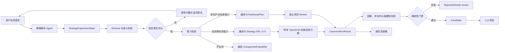
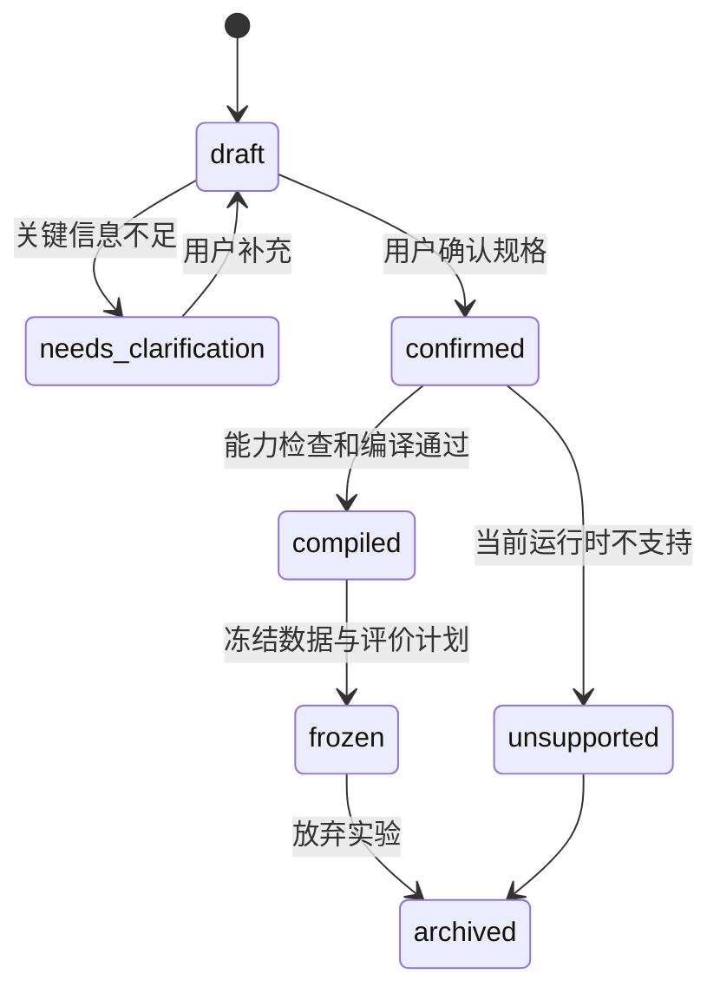

# 实验 Agent 策略研究技术设计（评审稿）

> 文档状态：实施中（M3 第一阶段：确定性校验门禁与可追溯报告已接入）
> 更新日期：2026-08-01
> 适用范围：策略工作室、策略回测、回测结果与因子研究的后续扩展  
> 本文只定义技术方案和实施边界，不代表相关功能已经完成。

### 本轮评审修订

- 设计已批准进入实施；下列 M0-M1 条件未全部通过前，禁止进入 M2；
- M1 增加 `SchemaRepairMiddleware`、分层修复指标和三栏点选确认交互；
- M4 确定为 DuckDB/Python 计算特征与调仓计划、TypeScript 统一撮合与资金账本；
- 取消首期黑盒策略自动修复，改为确定性错误分类、智能解释和用户重新提交；
- HTML/PDF 改为按需异步渲染，增加缓存、队列、制品过期和关键指标复制。

### M0-M1 实施硬门禁

1. Schema Repair 只能执行可证明“不改变业务语义”的转换，并保存原始输出、修复
   操作、字段 diff、校验结果、模型和提示词版本；
2. 单标的 Agent 路径与现有 UI 路径的黄金样例必须在 M2 前 100% 通过；
3. 能力清单必须从实际注册表、Schema 和已发布版本自动生成，禁止在提示词中维护
   第二份手工列表；
4. 打开锁定测试必须使用数据库级分布式锁和原子状态转换，并有并发测试覆盖。

### M0-M1 首批实施记录（2026-07-31）

以下基础门禁已经落地，但不代表 M1 的三栏确认界面和完整实验编排已经完成：

- `SchemaRepairMiddleware` 只允许数字字符串转数字、缺失的固定输出类型补全，以及
  系统元数据写入；不补规则、不猜参数、不重命名指标、不删除未知内容。每次处理返回
  修复前后 SHA-256、字段路径、操作类型和前后值，并写入结构化服务日志
  `strategy_schema_repair`。任何仍不满足 Schema 的输出直接返回 422，不再调用 LLM
  黑盒改写。
- 能力制品由 `scripts/generate-strategy-capabilities.mjs` 从前端实际
  `INDICATOR_REGISTRY` 与 Strategy DSL 类型定义生成；已发布因子版本在请求时从数据库
  合并。构建和测试前执行 `--check`，制品过期即失败。系统提示词、服务端校验和能力
  查询接口共用生成制品，不维护第二份指标、字段、运算符或风控规则清单。
- 新增单标的“双均线交叉”黄金样例：Agent DSL 和现有 UI 内置策略使用同一组 K 线、
  撮合参数和回测引擎，对可执行信号、成交、权益曲线及绩效指标执行严格相等断言。
  M2 前新增的每一种可映射策略仍须加入黄金样例矩阵，并保持 100% 通过。
- 因子锁定测试的启动临界区使用 MySQL `GET_LOCK`/`RELEASE_LOCK` 分布式互斥，
  锁内重新读取候选状态，再通过带原状态条件的 CAS 更新执行 `frozen → testing`。
  并发测试覆盖同一候选只能有一个启动者、异常释放锁及释放后重试。

对应验收命令：

```bash
npm run capabilities:check
npx vitest run src/features/visualStrategies/__tests__/capabilityParity.test.ts \
  src/features/backtest/__tests__/agentUiGoldenParity.test.ts
cd server
npm run capabilities:check
npx vitest run src/services/strategyGeneration/repairMiddleware.test.ts \
  src/services/strategyGeneration/capabilityRegistry.test.ts \
  src/db/distributedLock.test.ts
```

### M1 确认链路实施记录（2026-07-31）

- 服务端对通过 Schema 校验的 Strategy DSL 确定性生成
  `StrategyConfirmationDraft`，响应中明确分离 `sourceText`、
  `extractedFields` 和 `assumptions`；显式假设不会反向写入策略规则。
- 策略工作室的 AI 生成抽屉升级为“原始描述｜结构化抽取｜显式假设”三栏布局。
  所有必选假设逐项确认前，“导入到编辑器/应用修改草稿”保持禁用。
- 当前显式假设包括单标的范围、日线频率、下一交易时点成交、交易成本来源和回测
  区间来源；这些值来自当前引擎能力边界，而不是由模型补写。
- 前端对滚动升级期间缺少确认契约的旧服务端响应提供确定性回退：直接从已校验 DSL
  构建相同确认视图，不再次调用 LLM。
- 422 Schema 错误通过固定错误码和字段路径映射为中文提示，用户修改原始描述后重新
  提交；系统不自动改写已确认的策略。

### M2 首批实施记录（2026-07-31）

- AI 三栏确认通过后，服务端创建不可变的单标的
  `StrategyExperimentSpec v1`。当前支持范围固定为 A 股、日线、单标的、
  `visual_strategy` 与 `T 日收盘信号 → T+1 开盘成交`；服务端再次使用
  Strategy DSL Schema 校验，不能由前端绕过。
- 新增 `strategy_experiments`、`strategy_experiment_versions`、
  `strategy_experiment_runs`、`strategy_experiment_events` 和
  `strategy_experiment_validations` 五类治理表。规格、执行计划和权威结果均保存
  SHA-256；相同规格可以复用冻结版本，已运行版本不允许覆盖修改。
- 运行采用两阶段协议：服务端先冻结数据快照、引擎版本、策略参数、成本与仓位配置，
  再由现有浏览器 Web Worker 调用 `compileAndValidate()` 和
  `runBacktestAsync()`。M2 不生成 Python/JavaScript 源码，也没有第二套撮合器。
- 每次运行使用数据库唯一幂等键和输入 hash。并发重复请求返回同一运行；同一幂等键
  携带不同输入时返回 `IDEMPOTENCY_CONFLICT`。完成、失败和取消通过带原状态条件的
  CAS 更新，只有 `running` 可以进入终态。
- 运行完成时先持久化现有 `backtest_results`，随后服务端重新计算权威结果 hash，
  并核对冻结策略 ID/版本、数据快照、策略参数、回测配置和成交时序；任一不一致都
  拒绝关联。编译、黄金样例门禁和执行时序作为独立校验记录保存。
- 策略工作室保存的 AI 策略携带 `experimentVersionId`。在策略回测中选中该策略后，
  顶部显示实验标识；运行、取消、失败与完成会同步实验状态。普通手工策略仍沿用原
  回测路径，不会被错误挂接到实验版本。

### M3 第一阶段实施记录（2026-08-01）

- 新增版本化验证策略、样本隔离计划、门禁评价、结构化报告和报告制品任务表。
  默认策略版本为 `single-instrument-v1`，所有门槛由配置和 hash 固化，LLM 只能解释
  结果，不能改写门槛。
- 样本计划按训练、验证、锁定测试三段生成，并在边界应用 purge/embargo；同时生成
  3 折 Walk-forward 计划。计划绑定首个权威结果的数据快照、策略参数和回测配置
  hash，锁定测试打开后，服务端拒绝任何改变这些绑定的新运行。
- 锁定测试使用数据库 CAS：`sealed → opened` 更新必须携带原状态条件，并保存唯一
  open token。同一 token 重试幂等，不同 token 返回冲突。32 路并发契约测试保证只有
  一个调用者获胜。
- 因果验证包括 DSL 全树正向 offset/未来字段扫描、信号与成交快照边界、时间顺序，
  以及“收盘信号不得同 bar 成交”检查。测试中人工植入 `offset: 1` 会被拒绝。
- 浏览器权威引擎在基准结果后执行数值参数 ±5%/±10%、成本 2/3 倍、起止日期
  移动和额外一个 bar 延迟的扰动复算，并将最差收益衰减提交给确定性门禁。
- 每个报告数值保存 `sourcePath` 与 `calculatorVersion`；结构化 JSON 是权威制品，
  Markdown 可直接预览。HTML/PDF 使用按需异步任务和七天缓存，制品失败不会改变
  回测完成状态；HTML 可由结构化报告重建，PDF 在独立渲染 Worker 未配置时明确失败。
- 策略回测顶部展示 M3 门禁状态，可查看 Markdown 报告；打开锁定测试前必须二次
  确认，且同一实验版本只能执行一次。

本阶段仍需继续补齐：接入独立 PDF 渲染 Worker，以及在回测结果复盘页集中管理历史
实验报告。上述内容不提前计入 M3 完整验收。

## 1. 背景与结论

现有“策略工作室”已经能够将自然语言或可视化规则转换为受约束的
`Strategy DSL v1.0`，并通过 Web Worker 在单标的、日频、只做多场景下执行
回测。这个设计安全、可解释，也已经解决了基本的未来数据引用和 T+1 撮合
问题，但表达范围主要是技术指标条件、固定风控规则和单标的仓位变化，无法
直接覆盖以下研究需求：

- 动态股票池、横截面排名和多标的组合；
- 周度、月度调仓和组合级仓位约束；
- 基本面、行业、市值和因子条件；
- 批量参数实验、Walk-forward、锁定测试和稳健性门禁；
- 从自然语言策略到可复现实验报告的完整编排。

本项目建议建设“实验 Agent”，但不采用“LLM 直接生成任意 Python 并自动执行”
作为默认主路径。推荐架构是：

1. LLM 只负责将自然语言解析成版本化的结构化实验规格；
2. Zod Schema、语义校验器和确定性编译器负责决定能否执行；
3. 已支持的策略编译到现有 `Strategy DSL v1.0` 和 TypeScript 回测引擎；
4. 多资产或批量研究由独立研究 Worker 执行固定协议和白名单算子；
5. 任意 Python 仅作为隔离的高级实验模式，不能成为生产默认能力；
6. 所有实验必须绑定数据快照、代码版本、执行配置、随机种子和校验结果；
7. Agent 只生成候选和报告，不自动发布策略，更不连接真实资金。

这条路线可以先扩大策略描述和实验编排能力，同时保留现有确定性回测核心，
也与因子研究已经建立的“候选—锁定测试—人工批准”治理方式一致。

## 2. 现有系统基线

### 2.1 可直接复用的能力

| 现有能力 | 代码或数据位置 | 在实验 Agent 中的用途 |
| --- | --- | --- |
| Strategy DSL v1.0 | `src/features/visualStrategies` | 作为单标的技术策略的可执行信号 DSL |
| Zod 结构和语义校验 | `schema.ts`、`validator.ts` | 校验指标引用、参数、空规则和未来 offset |
| 确定性策略编译器 | `compiler.ts` | 将 DSL 编译为纯数据驱动的 `StrategyDefinition` |
| 回测 Web Worker | `src/workers/backtest.worker.ts` | 执行当前单标的策略和取消任务 |
| T+1 撮合、费用和滑点 | `src/features/backtest` | 作为首个权威精确回测实现 |
| 策略草稿与不可变版本 | `visual_strategies`、`strategy_versions` | 复用策略版本治理概念 |
| 回测结果快照 | `backtest_results`、`equity_points` | 保存当前引擎的完整结果 |
| DuckDB/Parquet 研究快照 | 服务端研究数据链路 | 固定实验数据事实源和血缘 |
| 因子 AST 与白名单编译 | `server/src/factorResearch` | 复用表达式治理和跨运行时一致性方法 |
| 因子候选状态机 | `factor_candidates` | 复用冻结、锁定测试、审批和发布门禁 |
| Python 挖掘 Worker | `miningWorker.ts` | 复用任务、进度、超时、取消和恢复模式 |

### 2.2 当前真实边界

必须在产品和 API 中明确当前引擎边界，不能让 Agent 用自然语言掩盖能力缺口：

| 能力 | 当前状态 | 说明 |
| --- | --- | --- |
| 日频、单标的、只做多 | 已支持 | 当前回测主路径 |
| T 日收盘生成信号，T+1 开盘成交 | 已支持 | `execution` 固定为 `next_open` |
| 手续费、最低佣金、卖出税、滑点 | 已支持 | 回测配置中已有字段 |
| 技术指标与固定风控 | 已支持 | 由 Strategy DSL 和编译器实现 |
| 单次信号按剩余资金/持仓比例交易 | 已支持 | 不是组合级优化 |
| 动态成分股、横截面排名 | 未由当前回测引擎支持 | 需要多资产组合引擎 |
| 周/月组合调仓 | 未由当前回测引擎支持 | 不能只靠生成 DSL 解决 |
| 基本面时点化选股 | 因子研究侧已有数据基础 | 策略侧仍需协议和执行适配 |
| 做空、期货保证金、期权 | 未支持 | 不纳入首期 |
| 分钟/Tick 事件驱动 | 未支持 | 不纳入首期 |
| 安全执行任意 Python | 未支持 | 当前 Python 子进程不是安全沙箱 |

### 2.3 不替换现有 Strategy DSL

实验 Agent 新增的是实验级中间表示，而不是废弃现有 DSL：

```text
自然语言
  ↓
StrategyExperimentSpec（实验规格/Intent IR）
  ↓ 能力检查与确定性编译
VisualStrategyDocument（现有信号 DSL）或 MultiAssetPlan（未来组合计划）
  ↓
权威回测引擎
```

`StrategyExperimentSpec` 负责表达市场、股票池、调仓、成本、样本切分和校验计划；
`VisualStrategyDocument` 继续只负责当前引擎能够确定执行的指标和买卖规则。分层
后可以避免在现有 DSL 中混入数据集、报告、任务状态等非交易规则。

## 3. 设计目标与非目标

### 3.1 目标

1. 将口语化策略稳定解析为有版本、可校验、可追踪的实验规格。
2. 对用户省略或含糊的关键字段显式提问或记录假设，而不是静默猜测。
3. 对现有能力范围内的策略进行确定性编译和回测。
4. 对超出能力范围的策略返回机器可读的“不支持能力”，而不是生成不可运行代码。
5. 建立批量实验、样本隔离、未来函数检测、参数扰动和成本压力测试。
6. 生成可复现的结构化结果，并渲染 Markdown、HTML 和 PDF 报告。
7. 保留完整审计轨迹，任何结论均可追溯到输入、数据和执行环境。

### 3.2 非目标

- 不让 LLM 直接决定绩效指标、门槛是否通过或策略是否发布；
- 不允许 Agent 自动调用模拟交易或实盘下单；
- 不以 `RestrictedPython` 代替操作系统级隔离；
- 不在首期实现期货、期权、做空、分钟和 Tick 策略；
- 不把漂亮的样本内曲线视为策略有效性证明；
- 不在同一锁定测试区间失败后自动改参数重试。

## 4. 核心架构



### 4.1 组件职责

| 组件 | 职责 | 是否允许 LLM 决策 |
| --- | --- | --- |
| Strategy Parser | 自然语言抽取、术语归一化、生成澄清问题 | 允许生成候选内容 |
| Spec Validator | Zod 结构校验、枚举和数值边界 | 不允许 |
| Semantic Validator | 时间语义、股票池、字段依赖和冲突校验 | 不允许 |
| Capability Resolver | 将规格映射到当前运行时能力 | 不允许 |
| Deterministic Compiler | Spec 到 DSL/执行计划 | 不允许 |
| Orchestrator | 状态机、任务调度、重试和审计 | 不允许 |
| Backtest Runtime | 执行交易和计算结构化结果 | 不允许 |
| Validation Runtime | 泄漏、样本外、扰动和成本校验 | 不允许 |
| Report Narrator | 基于固定数据生成文字解读 | 允许，但不能改数值 |
| Approval Gate | 候选批准、发布和模拟观察 | 必须由规则和人工完成 |

## 5. StrategyExperimentSpec v1

### 5.1 顶层结构

建议在共享包中定义 Zod Schema，并由前后端从同一来源生成 TypeScript 类型和
JSON Schema。首版字段如下：

```ts
interface StrategyExperimentSpec {
  schemaVersion: '1.0';
  id: string;
  name: string;
  thesis: string;
  market: MarketSpec;
  universe: UniverseSpec;
  data: DataRequirementSpec;
  schedule: ScheduleSpec;
  signal: SignalSpec;
  portfolio: PortfolioSpec;
  execution: ExecutionSpec;
  evaluation: EvaluationSpec;
  assumptions: ExplicitAssumption[];
  unresolvedQuestions: ClarificationQuestion[];
  provenance: SpecProvenance;
}
```

顶层规格必须是纯 JSON，不允许代码、SQL、文件路径、网络地址或可执行命令。

### 5.2 市场与股票池

```ts
interface MarketSpec {
  assetClass: 'cn_stock'; // 首期只开放 A 股
  currency: 'CNY';
  frequency: '1d';
  longShort: 'long_only';
}

type UniverseSpec =
  | { type: 'single'; instrumentKey: string }
  | {
      type: 'index_constituents';
      indexCode: '000300' | '000905' | '000852';
      membership: 'point_in_time';
      filters: UniverseFilter[];
    }
  | {
      type: 'screened_cn_equity';
      exchanges: Array<'SH' | 'SZ'>;
      filters: UniverseFilter[];
    };
```

硬性要求：

- 指数成分股必须使用时点成分，禁止用当前成分回填历史；
- ST、退市、上市天数、停牌和流动性过滤必须写入规格并版本化；
- 用户说“沪深 300 股票”时，默认解释为时点化沪深 300 成分股，但必须在界面
  中展示该假设；
- 首期若解析出多资产股票池，解析可以成功，但执行前必须经过能力检查；在多资产
  引擎完成前返回 `MULTI_ASSET_ENGINE_REQUIRED`。

### 5.3 数据需求

```ts
interface DataRequirementSpec {
  priceAdjustment: 'forward_adjusted' | 'unadjusted';
  fields: string[];
  pointInTimeFundamentals: boolean;
  minimumHistoryBars: number;
  snapshotPolicy: 'latest_published' | 'explicit_snapshot';
  snapshotId?: string;
}
```

财务字段必须满足 `announcementDate <= signalDate`。缺少时点化元数据的财务
条件不允许进入正式回测，只能标记为探索性运行。

### 5.4 调仓与信号

```ts
interface ScheduleSpec {
  decisionFrequency: 'daily' | 'weekly' | 'monthly';
  rebalanceRule:
    | { type: 'every_n_bars'; n: number }
    | { type: 'weekday'; weekday: 1 | 2 | 3 | 4 | 5 }
    | { type: 'month_end' };
}

interface SignalSpec {
  type: 'visual_strategy' | 'factor_rank' | 'composite';
  visualStrategy?: VisualStrategyDocument;
  factorRank?: {
    factors: Array<{
      factorVersionId: string;
      direction: 'higher-is-better' | 'lower-is-better';
      weight: number;
    }>;
    selectTop: number;
    exitRank?: number;
  };
  combine?: 'all' | 'any' | 'score';
}
```

`visual_strategy` 可直接复用当前 DSL。`factor_rank` 必须引用已发布因子版本，不
接受任意公式字符串。探索中的候选因子只能在显式的候选实验中使用，不能伪装成
正式因子。

### 5.5 组合与执行

```ts
interface PortfolioSpec {
  weighting: 'equal' | 'market_cap' | 'score' | 'optimizer';
  maxGrossExposure: number;
  maxPositionWeight: number;
  maxPositions: number;
  cashBuffer: number;
  turnoverLimit?: number;
  industryWeightLimit?: number;
}

interface ExecutionSpec {
  signalAt: 'close';
  fillAt: 'next_open';
  commissionRate: number;
  minimumCommission: number;
  sellTaxRate: number;
  slippageBps: number;
  lotSize: 100;
  forceCloseAtEnd: boolean;
  constraints: Array<
    'suspension' | 'limit_up_down' | 'insufficient_liquidity'
  >;
}
```

`signalAt='close'` 与 `fillAt='next_open'` 是首期唯一正式支持口径。用户若要求
“当日收盘买入”，解析器不能自动改写，应返回澄清或不支持结果。

### 5.6 评价与验证计划

```ts
interface EvaluationSpec {
  range: { start: string; end: string };
  split:
    | {
        type: 'chronological';
        trainRatio: number;
        validationRatio: number;
        lockedTestRatio: number;
        embargoBars: number;
      }
    | {
        type: 'walk_forward';
        trainBars: number;
        validationBars: number;
        testBars: number;
        stepBars: number;
        embargoBars: number;
      };
  benchmark: string;
  perturbations: PerturbationSpec[];
  gates: ValidationGateSpec[];
  randomSeeds: number[];
}
```

不能只使用“前 70% 训练、后 30% 测试”后再根据测试结果反复调参。建议至少分为
训练、验证和锁定测试三段；任何被用于选择规则、阈值或参数的数据均不再叫测试集。

### 5.7 解析输出状态

解析接口不能只返回一份貌似完整的 JSON。建议统一返回：

```ts
interface ParseStrategyResponse {
  status: 'ready' | 'needs_clarification' | 'unsupported';
  spec?: StrategyExperimentSpec;
  questions: ClarificationQuestion[];
  assumptions: ExplicitAssumption[];
  unsupportedCapabilities: UnsupportedCapability[];
  validation: {
    firstPassValid: boolean;
    deterministicRepairApplied: boolean;
    modelRepairApplied: boolean;
    remainingIssues: SchemaValidationIssue[];
  };
  parserModel: string;
  promptVersion: string;
  rawInputHash: string;
}
```

以下字段缺失时不得静默补齐并直接运行：

- 交易市场或标的范围；
- 信号使用的价格时点；
- 回测时间范围；
- 组合最大仓位和单标的最大仓位；
- 基本面字段的时点口径；
- 用户表述存在互斥买卖条件。

手续费和滑点可以使用项目级默认值，但必须列入 `assumptions` 并在运行前展示。

## 6. 固定系统提示词与解析流程

### 6.1 提示词职责

系统提示词应只做抽取和归一化，不要求模型生成回测代码。固定规则至少包括：

1. 只返回符合 JSON Schema 的对象；
2. 不得创建 Schema 以外字段；
3. 不得输出 Python、JavaScript、SQL 或命令；
4. 不得把未知值编造为确定事实；
5. 关键字段不明确时写入 `unresolvedQuestions`；
6. 所有默认值写入 `assumptions`；
7. 明确区分信号时点和成交时点；
8. 基本面条件必须声明 point-in-time；
9. 不得承诺策略有效、通过门禁或可以实盘；
10. 输出中的指标、因子和股票池标识必须来自服务端提供的能力清单。

### 6.2 Schema Repair Middleware

严格 Schema 输出不能只依赖提示词和模型的首次生成。M1 必须在模型与业务 Schema
之间增加 `SchemaRepairMiddleware`，但修复范围只限于结构和类型，不负责补写交易
意图。

建议处理链如下：

```text
模型原始输出
→ 提取 JSON 候选
→ 确定性语法修复
→ JSON Schema/Zod 校验
→ 标准化错误列表
→ 一次受约束的模型修复（可选）
→ 再次完整校验
→ 语义缺失进入 needs_clarification
```

第一层确定性修复只处理不改变业务语义的情况，例如 Markdown 代码围栏、尾随逗号、
可确定的数字字符串和已知枚举别名。第二层模型修复只接收：

- 原始模型输出；
- JSON Schema 中发生错误的最小字段片段；
- Zod issue 或 Ajv error stack 标准化后的 `path/code/message`；
- 能力清单和允许的枚举；
- “不得新增假设、不得改变已合法字段”的固定修复提示词。

模型修复最多执行一次。缺少股票池、时间区间、成交时点或仓位约束等业务字段时，
Repair Middleware 不得自行回填，而应生成 `ClarificationQuestion`。修复前后 JSON、
字段级 diff、校验错误、模型和提示词版本都要进入审计事件。

项目当前已使用 Zod，首版可直接将 Zod issue 适配为统一错误结构，不必只为错误定位
引入第二套校验器；如果后续模型供应商的 Structured Output 使用 JSON Schema，
可增加 Ajv 适配器，但 Zod 语义校验仍是最终权威。

建议错误结构为：

```ts
interface SchemaValidationIssue {
  path: Array<string | number>;
  code: string;
  message: string;
  expected?: unknown;
  received?: unknown;
  repairable: boolean;
}
```

必须分别统计首次结构通过率、确定性修复成功率、模型修复成功率和最终澄清率，不能
只报告合并后的“解析成功率”。

### 6.3 能力清单注入

提示词不应永久写死所有指标。服务端每次解析时注入版本化的能力清单：

```json
{
  "capabilityVersion": "2026-07-31",
  "markets": ["cn_stock"],
  "frequencies": ["1d"],
  "executionModels": ["close_to_next_open"],
  "visualIndicators": ["sma", "ema", "boll", "macd", "rsi", "kdj"],
  "publishedFactorVersionIds": [],
  "supportedUniverseTypes": ["single"],
  "plannedUniverseTypes": ["index_constituents", "screened_cn_equity"]
}
```

解析后仍由确定性 `CapabilityResolver` 复核，不能信任模型自行判断能力支持情况。

### 6.4 解析和确认时序

```text
用户输入
→ 保存原文与 hash
→ LLM 结构化输出
→ Schema Repair Middleware
→ JSON Schema/Zod 完整校验
→ 术语与标识归一化
→ 语义校验
→ 能力检查
→ 三栏展示原文、结构化抽取、显式假设
→ 用户点选确认或补充问题
→ 用户确认
→ 创建不可变实验版本
```

用户修改任意交易逻辑、股票池、数据切分或成本配置时，必须创建新版本，不能覆盖
已经运行或已经打开锁定测试的版本。

确认界面采用三栏对照式布局：

| 原文 | 结构化抽取 | 显式假设与待确认项 |
| --- | --- | --- |
| 高亮当前字段对应的原始片段 | 按市场、股票池、信号、仓位、成本分组 | 显示默认来源、置信状态和可选项 |

交互以点选为主：接受默认、从允许枚举中选择、标记“不适用”或返回原文修改。字段应
保留原文证据区间 `sourceSpan`，用户点击结构化字段时可定位对应原文。自由输入只用于
Schema 无法覆盖的补充说明，不能让用户在隐藏的 JSON 编辑器里承担修复工作。

## 7. 确定性编译与运行时分层

### 7.1 首期编译路径

首期只实现当前能力范围内的编译：

```text
StrategyExperimentSpec
  ├─ universe.type == single
  ├─ market.frequency == 1d
  ├─ signal.type == visual_strategy
  └─ execution == close_to_next_open
        ↓
复用 compileAndValidate()
        ↓
现有 runBacktestAsync()
```

这条路径不生成源代码，不调用 `eval` 或 `new Function`，应作为首期权威回测。

### 7.2 多资产执行计划

沪深 300/中证 500 选股、因子排名和组合调仓必须新增多资产引擎，不能将每只股票
独立回测后简单相加。M4 采用“DuckDB/Python 计算平面 + TypeScript 执行平面”的
混合模式，避免在 TypeScript 中重写横截面研究生态，也避免让 Python 同时决定特征
和资金账本。

职责划分如下：

| 平面 | 运行时 | 职责 |
| --- | --- | --- |
| 数据与特征 | DuckDB + Python Worker | 时点股票池、字段读取、横截面因子、排名、中性化、目标权重 |
| 计划协议 | 版本化 JSON | 固化每个决策日的候选、分数、目标权重、证据和数据 hash |
| 订单与资金 | TypeScript 执行 Worker | 可交易检查、卖买顺序、整手、现金、费用、滑点、持仓和权益 |
| 一致性验证 | TypeScript 测试 + Python 测试 | Schema、资金守恒、黄金样例和跨运行时数值容差 |

建议输入执行协议为：

```ts
interface MultiAssetPlan {
  planVersion: '1.0';
  snapshotId: string;
  calendarId: string;
  universePlan: PointInTimeUniversePlan;
  featurePlan: FeaturePlan;
  signalPlan: CrossSectionalSignalPlan;
  rebalancePlan: RebalancePlan;
  portfolioPlan: PortfolioConstraintPlan;
  executionPlan: ExecutionPlan;
}
```

Python 计算平面输出确定性的 `RebalancePlan`，而不是直接输出权益曲线：

```ts
interface RebalancePlan {
  protocolVersion: '1.0';
  snapshotId: string;
  featureEngineVersion: string;
  planHash: string;
  decisions: Array<{
    decisionDate: string;
    executableFrom: string;
    universeHash: string;
    featureHash: string;
    targets: Array<{
      instrumentKey: string;
      score?: number;
      targetWeight: number;
      reasonCodes: string[];
    }>;
  }>;
}
```

`decisionDate` 是信息截点，`executableFrom` 首期必须是下一交易日。TypeScript
执行平面必须拒绝权重和超过上限、标的不在当日时点股票池、日期倒序、数据 hash
不匹配或包含未知标的的计划。

两个平面在每个调仓时点共同完成：

- DuckDB/Python 只使用当日可知的股票池和字段；
- DuckDB/Python 计算横截面排名、缺失值和中性化；
- TypeScript 根据交易日状态处理停牌、涨跌停、上市和退市；
- 组合资金、整手、现金余量和权重漂移；
- 卖出与买入的先后顺序；
- 费用、滑点、换手和不可成交残留；
- 同一组合的统一权益曲线，而不是股票级结果拼接。

现有浏览器 Web Worker 不应加载全市场面板。M4 应将 TypeScript 撮合核心抽取为纯
模块，在服务端 Worker 中运行；前端只接收进度和结果。Python 不写数据库，Node
Orchestrator 通过只读快照和 JSON/Arrow/Parquet 制品与其交换数据。

跨运行时一致性通过固定黄金样例锁定：

- Python 与 DuckDB 对相同截面特征、排名和目标权重结果一致；
- TypeScript 对固定 `RebalancePlan` 产生固定订单、现金、持仓和权益；
- 修改未来数据不改变历史 `RebalancePlan`；
- 协议版本、数值精度、NaN、并列排名和交易日历均有明确约定。

### 7.3 VectorBT 与事件引擎的定位

若后续引入 VectorBT，建议只用于大量参数和候选策略的快速筛选，不直接成为最终
审计结果。通过初筛的候选应由统一执行口径的权威引擎复算。

```text
批量向量化初筛
→ 少量候选
→ 权威撮合引擎精确复算
→ 稳健性与锁定测试
```

Backtrader 或自研事件引擎适合复杂订单状态，但引入第二个引擎会产生撮合口径差异。
在决定引入前，应先完成相同输入、相同信号、相同费用下的黄金样例一致性测试。

## 8. 代码生成与沙箱策略

### 8.1 三档运行模式

| 档位 | 输入 | 运行方式 | 发布资格 |
| --- | --- | --- | --- |
| A：结构化 DSL | Strategy DSL / MultiAssetPlan | 确定性编译器和内置运行时 | 可进入正式门禁 |
| B：白名单插件 | 已安装、已审核的策略插件及参数 | 隔离 Worker 调用固定入口 | 可在复核后进入门禁 |
| C：任意 Python 实验 | LLM 生成或用户提交代码 | 强隔离临时沙箱 | 仅探索，不可直接发布 |

默认只开放 A。B 需要代码审查、固定依赖、签名和版本。C 即使运行成功，也必须先
转换成可审计的 DSL/插件并由权威引擎复算，才能进入候选治理。

### 8.2 不适合作为安全边界的方案

- `RestrictedPython` 是语言子集限制工具，不是完整安全沙箱；
- Pyodide 更适合浏览器中的 Python 体验，不能替代服务端进程和内核隔离；
- 当前 `miningWorker.ts` 启动的 Python 子进程继承环境变量，并可访问宿主文件系统，
  它具备任务治理价值，但不能原样作为不可信代码的安全边界；
- 仅启动普通 Docker 容器仍不足够，尤其不能挂载 Docker Socket 或敏感宿主目录。

### 8.3 生产沙箱最低要求

任意代码模式只允许部署在 Linux 专用 Worker 节点，并至少满足：

- 每次运行使用全新短生命周期容器或更强的 microVM/gVisor 隔离；
- 非 root 用户、只读根文件系统、临时 `tmpfs` 工作区；
- 默认断网；如需数据，只通过只读输入挂载或受控数据代理；
- 不注入数据库密码、模型密钥、对象存储密钥和宿主环境变量；
- 禁止宿主路径写入、Docker Socket、特权模式和设备挂载；
- drop all capabilities，启用 seccomp/AppArmor/SELinux 等策略；
- 限制 CPU、内存、进程数、打开文件数、输出大小和墙钟时间；
- 运行结束销毁环境，只导出声明过的 JSON 和图表制品；
- 镜像使用固定 digest，依赖有锁文件和漏洞扫描；
- 保存镜像 digest、代码 hash、依赖清单和资源使用记录。

Windows 本地开发环境可以调度受信任的内置 Worker，但不能宣称具备不可信代码
隔离能力。开发阶段的任意代码入口应默认关闭。

## 9. 智能报错映射与重新提交

首期不实现回测代码或策略逻辑的黑盒自动修复。“自动修复”只保留在第 6.2 节的
Schema 结构修复层；一旦创建实验版本并进入编译或运行，系统只分类、解释和给出
可操作建议，不自动修改策略。

### 9.1 确定性错误分类

错误码由发生错误的组件直接产生，不依靠 LLM 从任意 Traceback 猜测：

| 错误类别 | 产生组件 | 用户动作 |
| --- | --- | --- |
| `SCHEMA_INVALID` | Schema Validator | 查看字段定位并修正描述/选项 |
| `SEMANTIC_CONFLICT` | Semantic Validator | 解决冲突条件 |
| `UNSUPPORTED_CAPABILITY` | Capability Resolver | 缩小范围或等待能力实现 |
| `COMPILE_FAILED` | Deterministic Compiler | 根据规则路径修正策略 |
| `DATA_MISSING` | Data Resolver | 更换快照、区间或字段 |
| `DATA_QUALITY_FAILED` | Data Gate | 修复数据后重新运行 |
| `RESOURCE_EXCEEDED` | Worker Supervisor | 缩小实验或提高已审批预算 |
| `RUNTIME_FAILED` | Runtime Adapter | 提交工程问题，不自动改策略 |
| `VALIDATION_FAILED` | Validation Gate | 查看研究结论，不作为程序错误重试 |

底层异常先由 Typed Error 包装；未知异常统一为 `INTERNAL_ERROR` 并附关联 ID，不能
让 Agent 自行把未知错误降级成可重试错误。

### 9.2 Agent 的允许职责

Agent 可以把结构化错误转换成通俗中文，解释错误发生在哪个字段、为什么不能执行，
并根据能力清单给出可点选的修正建议。Agent 不得：

- 修改已经确认的策略 JSON 或生成补丁并静默重跑；
- 删除无法计算的条件；
- 自动放宽数据、成本、风险和验证门槛；
- 将 `VALIDATION_FAILED` 描述成系统故障；
- 读取锁定测试结果后建议针对该区间调参。

用户在三栏确认界面修改自然语言或点选字段后重新提交。若版本尚未运行，可以更新
草稿；已经运行、冻结或打开锁定测试时，必须创建新实验版本。

### 9.3 基础设施重试

网络瞬断、队列投递失败等与策略无关的基础设施错误，可以由 Orchestrator 使用同一
输入 hash 幂等重试；默认指数退避，最多 3 次。每次保留 attempt，但不得改变策略、
数据、成本和评价配置。业务错误和校验失败不进入该重试机制。

## 10. 回测校验模块

### 10.1 未来数据和时点因果

现有 `offset > 0` 检查应保留，但它只能覆盖显式 DSL 引用。完整校验分为：

**静态校验**

- 行情和指标 offset 必须小于等于 0；
- 指标实现必须声明最大回看窗口和是否包含当前 bar；
- 基本面必须具备公告日并满足时点条件；
- 指数成分和行业分类必须读取信号日可知版本；
- 禁止在信号计算中引用下一开盘、未来收益和全样本统计；
- 标准化、缩尾和中性化必须按当日横截面或训练窗口计算。

**动态校验**

- 截断一致性：用截至 T 日数据计算的 T 日信号，应与全量数据中 T 日信号一致；
- 前缀回放：逐步增加数据前缀，历史信号不得发生变化；
- 数据扰动：修改 T 日之后数据，T 日及以前的信号和特征不得变化；
- 双实现黄金样例：Python、DuckDB 或 TypeScript 同一算子结果在约定容差内一致。

“当日收盘价生成信号并在当日收盘成交”属于时序冲突。首期统一使用 T 日收盘信号、
T+1 开盘成交。

### 10.2 样本内外与 Walk-forward

默认研究流程建议为：

```text
训练集：拟合或构造规则
→ 验证集：参数选择、早停和候选排名
→ 冻结策略版本
→ 锁定测试集：只打开一次
→ 分阶段和扰动复核
```

存在多日持有标签或滚动特征时，切分边界应设置 purge/embargo，避免训练标签跨入
验证或测试区间。Walk-forward 每折必须携带只用于预热的历史，但预热样本不计入
该折绩效。

### 10.3 参数与环境扰动

每个候选至少执行以下扰动：

- 数值参数按允许范围进行 ±5%、±10% 或相邻整数扰动；
- 手续费和滑点使用 1 倍、2 倍、3 倍压力；
- 成交延迟增加一个交易 bar；
- 回测起止日期按固定窗口前后移动；
- 股票池过滤阈值做小幅扰动；
- 对需要随机过程的策略使用多个固定随机种子；
- 分牛熊、震荡阶段和流动性分组报告；
- 多资产策略增加容量、换手和行业暴露检查。

扰动结果不能只给“通过/失败”，还应保存指标分布、最差情形和相对基准衰减。

### 10.4 确定性门禁

门禁配置必须版本化，LLM 只能解释结果，不能决定门槛。首版门禁类别：

| 类别 | 示例检查 |
| --- | --- |
| 数据 | 快照已发布、checksum 正确、覆盖率达标、非合成数据 |
| 因果 | 静态校验和动态前缀测试全部通过 |
| 样本外 | 锁定测试为正、相对训练集衰减未超限 |
| 风险 | 最大回撤、波动、尾部损失在门槛内 |
| 交易 | 成本后收益、成交率、换手和容量可接受 |
| 稳健性 | 参数、日期、成本扰动未出现结构性崩溃 |
| 统计 | 报告试验总数及多重检验调整结果 |
| 治理 | 版本冻结、审计完整、人工批准 |

具体数值阈值不写死在本文，应保存为 `validationPolicyVersion` 对应的配置。

## 11. 状态机与治理

### 11.1 实验版本状态



### 11.2 单次运行状态

```text
queued → preparing → running → validating → completed
                  ↘ failed
                  ↘ cancelled
validating → rejected | candidate
candidate → approved | rejected
approved → paper（可选，仍需人工操作）
```

状态转换由服务端事务控制。前端不能直接写状态字符串。`approved` 也不代表自动
发布或实盘，只表示研究候选通过当前审批。

### 11.3 锁定测试规则

- 版本进入 `frozen` 后，策略、参数空间、快照、股票池和测试区间均不可修改；
- 锁定测试只能从未打开状态原子转换为 `testing`；
- 失败、取消或服务重启需要区分是否已经读取测试数据；
- 一旦产生锁定测试指标，就不能回到同一版本调参；
- 后续修改必须创建新版本，并向后滚动新的测试区间；
- 测试指标不得反馈给 Agent 建议、Schema Repair 或重新提交提示。

## 12. 数据模型建议

不建议把所有 Agent 信息继续塞入 `visual_strategies` 或 `backtest_results`。
新增实验域表，同时复用现有策略和回测结果：

### 12.1 `strategy_experiments`

逻辑研究项目，可包含多个不可变版本。

| 字段 | 说明 |
| --- | --- |
| `id` | UUID |
| `name` | 实验名称 |
| `status` | active/archived |
| `created_by` | 创建者标识 |
| `created_at`、`updated_at` | 审计时间 |

### 12.2 `strategy_experiment_versions`

| 字段 | 说明 |
| --- | --- |
| `id` | UUID |
| `experiment_id` | 所属实验 |
| `version` | 单调递增版本 |
| `status` | draft/confirmed/compiled/frozen/unsupported |
| `raw_prompt` | 用户原始描述；敏感信息需脱敏 |
| `raw_prompt_hash` | 原始输入 hash |
| `spec` | `StrategyExperimentSpec` JSON |
| `spec_hash` | 规范化 JSON hash |
| `compiled_plan` | DSL 或执行计划 JSON |
| `compiled_plan_hash` | 执行计划 hash |
| `capability_version` | 能力清单版本 |
| `prompt_version` | 系统提示词版本 |
| `parser_model` | 实际解析模型 |
| `created_at`、`confirmed_at`、`frozen_at` | 生命周期时间 |

唯一约束：`(experiment_id, version)`。

### 12.3 `strategy_experiment_runs`

| 字段 | 说明 |
| --- | --- |
| `id` | UUID |
| `experiment_version_id` | 不可变版本 |
| `attempt` | 运行/修复尝试序号 |
| `run_type` | screening/exact/validation/locked_test |
| `status` | queued/preparing/running/validating/completed/failed/cancelled |
| `snapshot_id` | 已发布研究快照 |
| `runtime` | ts_web_worker/python_vectorized/event_engine |
| `runtime_version` | 引擎语义版本 |
| `code_hash`、`image_digest` | 执行环境血缘 |
| `seed` | 固定随机种子 |
| `resource_budget`、`resource_usage` | 资源限制及实耗 |
| `backtest_result_id` | 可选，关联现有 `backtest_results` |
| `result_manifest` | 多资产或批量结果清单 |
| `error_code`、`error_message` | 结构化失败原因 |
| `started_at`、`finished_at` | 运行时间 |

当前单标的精确回测继续写入 `backtest_results`，实验运行只保存引用。未来多资产结果
体积较大时，权益、订单和图表制品写入制品存储，表中只保存 URI、checksum 和摘要。

### 12.4 `strategy_validation_results`

每个校验项一条或按校验套件保存，至少包含：

- `run_id`、`validator_id`、`validator_version`；
- `status`：passed/failed/warning/skipped；
- `metrics`、`thresholds`、`evidence_uri`；
- `created_at`。

### 12.5 `strategy_report_jobs`

保存按需 HTML/PDF 渲染队列，不与回测运行状态混用：

- `id`、`run_id`、`format`、`status`；
- `cache_key`、`template_version`；
- `resource_budget`、`attempt`；
- `artifact_id`、`error_code`、`error_message`；
- `created_at`、`started_at`、`finished_at`。

唯一约束可使用 `(cache_key, status)` 的业务幂等检查，避免同一报告被并发重复渲染。

### 12.6 `strategy_experiment_artifacts`

保存报告、图表、交易清单和验证证据引用：

- `id`、`run_id`、`artifact_type`、`uri`、`mime_type`；
- `checksum`、`size_bytes`、`generator_version`；
- `retention_class`、`expires_at`、`created_at`；
- `deleted_at`，用于记录生命周期清理，不直接丢失审计轨迹。

结构化结果和审批证据使用长期保留级别；普通 HTML、临时图表等可重建制品使用短期
保留级别。

### 12.7 `strategy_experiment_events`

追加写审计日志，保存状态转换、用户确认、Agent 解析、编译、重试、锁定测试和审批
事件。事件包含操作者类型 `user/system/agent`、前后状态、原因和关联对象。

## 13. API 草案

API 使用 `/api/strategy-experiments` 命名空间，首期建议如下：

| 方法与路径 | 用途 |
| --- | --- |
| `POST /parse` | 自然语言解析，尚不创建正式版本 |
| `POST /` | 创建实验及 v1 草稿 |
| `POST /:id/versions` | 基于用户修改创建新版本 |
| `GET /:id` | 获取实验、版本和摘要 |
| `POST /versions/:versionId/confirm` | 用户确认结构化规格 |
| `POST /versions/:versionId/compile` | 确定性能力检查与编译 |
| `POST /versions/:versionId/freeze` | 冻结规格、数据和评价计划 |
| `POST /versions/:versionId/runs` | 创建 screening/exact/validation 运行 |
| `GET /runs/:runId` | 查询状态、进度和结果摘要 |
| `POST /runs/:runId/cancel` | 取消可取消任务 |
| `GET /runs/:runId/events` | 查询运行事件或 SSE 进度 |
| `GET /runs/:runId/validations` | 查询校验明细 |
| `POST /versions/:versionId/open-locked-test` | 原子打开一次锁定测试 |
| `POST /versions/:versionId/approve` | 人工批准候选 |
| `GET /runs/:runId/report` | 获取结构化摘要或 Markdown |
| `POST /runs/:runId/report-jobs` | 按需创建 HTML/PDF 异步渲染任务 |
| `GET /report-jobs/:jobId` | 查询渲染进度和制品引用 |

所有变更状态的请求应支持幂等键。编译、冻结、打开锁定测试和批准接口需要检查当前
状态，非法转换返回 `409`，不做隐式纠正。

## 14. Worker 协议与任务恢复

### 14.1 输入清单

Worker 不接收数据库凭据，只接收不可变任务清单：

```json
{
  "protocolVersion": "1.0",
  "runId": "uuid",
  "runType": "exact",
  "specHash": "sha256:...",
  "plan": {},
  "snapshot": {
    "id": "snapshot-id",
    "manifestUri": "readonly-input",
    "checksum": "sha256:..."
  },
  "validationPolicyVersion": "v1",
  "seed": 42,
  "resourceBudget": {
    "timeoutMs": 900000,
    "maxMemoryMb": 4096,
    "maxOutputMb": 100
  }
}
```

### 14.2 输出清单

```ts
interface CanonicalRunResult {
  protocolVersion: '1.0';
  runId: string;
  status: 'completed' | 'failed' | 'cancelled';
  lineage: RunLineage;
  metrics: Record<string, MetricValue>;
  periods: PeriodMetric[];
  tradesSummary: TradeSummary;
  artifacts: ArtifactRef[];
  warnings: StructuredWarning[];
}
```

`MetricValue` 同时保存值、单位、计算器 ID 和版本，避免不同引擎把同名“夏普”
按不同口径展示。

### 14.3 恢复策略

- 服务重启时将没有活动 Worker 的 `running` 任务标为 `failed` 或 `interrupted`；
- 只有具备完整检查点且执行计划 hash 未变化的任务可以恢复；
- 恢复后 attempt 增加，旧 attempt 保留；
- 锁定测试运行恢复不能重新创建不同配置；
- 进度消息可以丢失，最终状态必须以持久化清单为准。

## 15. 报告生成与渲染

### 15.1 单一事实源

所有格式均从 `CanonicalRunResult + ValidationResults + Spec` 渲染，但不在每次
回测结束时同步生成全部格式：

```text
结构化结果
  ├─ 页面摘要与“一键复制关键指标”（默认、即时）
  ├─ Markdown（默认、低成本模板）
  ├─ HTML 交互报告（按需、可过期）
  └─ PDF 固化报告（按需、异步队列）
```

不允许让 LLM 从日志重新计算收益、夏普或回撤。LLM 仅根据结构化字段生成自然语言
摘要，摘要中的数字应通过模板引用已有指标。

前端的“一键复制关键指标”输出固定文本模板，包含策略版本、快照、区间、总收益、
年化收益、最大回撤、夏普、交易数、成本和锁定测试状态，满足大部分分享需求，无需
为此启动浏览器渲染器。

### 15.2 固定报告模块

1. 策略概述、适用市场和明确假设；
2. 数据快照、股票池、时间区间和时点口径；
3. 信号、调仓、仓位、费用和成交规则；
4. 训练、验证、锁定测试和 Walk-forward 设置；
5. 核心绩效指标及指标口径；
6. 累计权益、基准、回撤和年度收益图；
7. 交易、换手、成本、成交失败和容量摘要；
8. 未来函数和数据泄漏校验；
9. 参数、成本、日期和市场阶段扰动；
10. 多重检验、限制、适用行情和已知缺陷；
11. 版本、hash、运行时和审批审计。

### 15.3 制品要求

每个制品保存：

- `artifactType`、URI、MIME、文件大小；
- SHA-256 checksum；
- 生成器和版本；
- 关联 run ID；
- 创建时间、`expiresAt` 和保留策略。

HTML 中的交互图不能成为唯一记录；锁定测试和审批必须保留不可变的结构化摘要，
PDF 由用户或审批流程明确请求，不作为每次运行的强制同步步骤。

### 15.4 异步渲染与生命周期

HTML/PDF 进入独立低优先级队列，与回测 Worker 隔离资源：

- 默认并发数为 1～2，并设置单任务 CPU、内存和墙钟限制；
- 使用 `runResultHash + templateVersion + format` 作为缓存键，避免重复渲染；
- PDF 只渲染核心静态图和表格，不把所有交互图逐一截图；
- 报告任务失败不改变回测和验证状态；
- 页面轮询或 SSE 展示 queued/rendering/completed/failed；
- 普通 HTML 制品默认保留 7 天，过期后可由结构化结果重新生成；
- PDF 默认保留 30 天；已批准版本可按审计策略转为长期保留；
- 结构化结果、指标和审批证据按研究记录策略长期保存；
- 清理任务只删除可重建制品，不删除 CanonicalRunResult 和校验记录。

Puppeteer/Playwright 只能运行在报告队列 Worker，不得嵌入 API 请求线程。实现时应先
评估直接由图表库生成 SVG/PNG 的方案，只有确实依赖浏览器布局时才使用无头浏览器。

## 16. 分阶段实施计划

### M0：实验规格与能力边界

- 建立共享 `StrategyExperimentSpec v1` Zod Schema；
- 定义解析响应、显式假设、澄清问题和不支持能力；
- 建立能力注册表和 `CapabilityResolver`；
- 将现有 `VisualStrategyDocument` 映射为实验规格中的 `visual_strategy`；
- 为规范化 JSON、hash 和版本兼容增加测试。

验收：

- 同一输入规范化后 hash 稳定；
- 多资产策略能被正确解析，但在当前引擎上明确返回能力缺口；
- 任何可执行代码、未知指标和未来成交语义均无法通过 Schema/语义校验。

### M1：自然语言解析与人工确认

- 新增结构化解析 API；
- 固定并版本化系统提示词和能力清单；
- 实现 `SchemaRepairMiddleware`、统一错误路径和一次受约束的结构修复；
- 前端实现“原文—结构化字段—显式假设”三栏对照和点选确认；
- 用户确认后创建不可变实验版本。

验收：

- 分别报告首次通过、确定性修复、模型修复和最终澄清率；
- Repair Middleware 不会为缺失交易意图编造默认值；
- 建立不少于 200 条的模糊、冲突和完整策略标注集，覆盖“挑点强势股”等短输入；
- 修复后结构通过率目标不低于 95%，但语义缺失必须进入澄清，不能为追求通过率回填；
- 以字段级 precision/recall 和人工确认修改率衡量语义质量，不以 JSON 可解析率代替；
- 关键字段缺失时不能进入编译；
- 默认成本等假设在运行前可见；
- 模型输出不能直接触发回测。

### M2：接入现有单标的权威回测

- 编译支持子集到当前 Strategy DSL；
- 复用 `compileAndValidate()` 和 `runBacktestAsync()`；
- 新增实验、版本、运行、事件和校验数据表；
- 将现有 `backtest_results` 关联到实验运行；
- 建立运行状态、取消、失败分类和幂等控制。

验收：

- 相同快照、规格、运行时版本和配置得到一致关键结果；
- Agent 路径与手工策略工作室路径的黄金样例完全一致；
- T 日收盘信号只能在 T+1 开盘成交。

### M3：校验门禁与报告

- 实现静态和动态未来数据检查；
- 实现训练/验证/锁定测试隔离和 Walk-forward；
- 实现参数、成本、日期和延迟扰动；
- 接入版本化门禁策略；
- 默认生成结构化摘要和 Markdown；
- 建立按需 HTML/PDF 异步队列、缓存和制品清理任务。

验收：

- 锁定测试打开一次后无法在同一版本调参；
- 人为植入未来函数的测试策略被静态或动态检查拦截；
- 报告任一数值可追溯到结构化指标和计算器版本；
- PDF 渲染失败或队列拥堵不影响回测结果状态；
- 过期 HTML 可从结构化结果按相同模板版本重建。

### M4：多资产组合引擎

- 定义并实现 `MultiAssetPlan`；
- 使用 DuckDB/Python 读取时点数据并生成版本化 `RebalancePlan`；
- 使用 DuckDB/Python 支持横截面排名、等权/评分权重、周/月调仓；
- 将 TypeScript 撮合核心抽取到服务端 Worker，处理资金、整手、停牌、涨跌停、
  成本和换手；
- 建立 Python/DuckDB 特征结果与 TypeScript 撮合结果的黄金样例；
- 与现有因子版本和冠军/挑战者治理对接。

验收：

- 不使用当前成分股回填历史；
- Python 计算平面不能直接写资金账本或最终权益；
- TypeScript 执行平面拒绝 hash、日期、股票池或权重校验失败的计划；
- 多资产资金守恒，订单、持仓和权益可逐日核对；
- 组合结果不是单股票回测结果的事后拼接；
- 同一因子策略与因子研究侧的信号和收益口径一致。

### M5：批量筛选与高级隔离运行

- 评估 VectorBT 等向量化筛选运行时；
- 建立筛选结果到权威引擎的复算流程；
- 引入专用 Linux Worker 和生产级沙箱；
- 在默认关闭状态下试验任意 Python；
- 建立依赖锁定、镜像签名和安全审计。

验收：

- 任意代码无法访问网络、宿主文件、密钥和其他任务；
- 超时、内存、进程和输出限制均有破坏性测试；
- 任意 Python 结果不能绕过权威复算和人工审批。

## 17. 测试策略

### 17.1 单元测试

- Spec Schema、语义规则、归一化和 hash；
- Schema Repair 可修复范围、错误路径和修复前后 diff；
- 能力解析和错误码；
- Spec 到 DSL/Plan 编译；
- `RebalancePlan` 日期、权重、股票池和 hash 校验；
- 状态机合法和非法转换；
- 门禁阈值、指标单位和结果 Schema；
- 报告缓存键、过期策略和队列状态；
- 提示词版本和模型输出边界。

### 17.2 黄金样例

至少覆盖：

- 双均线、RSI、MACD 和止损策略；
- T 日信号/T+1 开盘成交；
- 最低佣金、卖出税、滑点和整手；
- 停牌、涨跌停、退市和期末持仓；
- 指数成分变更和财务公告日；
- 单标的 Agent 路径与现有 UI 路径结果一致；
- Python/DuckDB 固定截面输出相同排名、目标权重和特征 hash；
- TypeScript 对固定 `RebalancePlan` 输出相同订单、现金和权益；
- 多运行时指标和订单结果的容差一致。

### 17.3 对抗与安全测试

- 提示词注入要求输出代码、读取文件或忽略 Schema；
- Repair 模型借修复错误之名新增条件、改变合法字段或编造默认值；
- 超大 JSON、深层递归规则和资源耗尽输入；
- Python 读取环境变量、宿主目录、网络和进程信息；
- fork bomb、无限循环、超大 stdout 和压缩炸弹；
- 伪造 Worker 完成清单、checksum 和 artifact URI；
- 伪造 `RebalancePlan` 的 snapshot、universe、feature hash 和权重；
- 并发打开锁定测试和并发审批。

### 17.4 方法学回归测试

- 未来数据修改不影响历史信号；
- 训练和验证数据不可读取锁定测试；
- 多日标签边界正确 purge/embargo；
- 测试指标不能参与参数选择；
- 重叠收益不能被当作独立日收益复利；
- 合成数据不会生成正式 OOS 通过结论。

## 18. 可观测性与运维

每次运行至少记录以下指标：

- 各状态耗时、排队时间和成功率；
- LLM 解析耗时、token、格式失败率和澄清率；
- 首次 Schema 通过率、确定性修复率、模型修复率和人工字段修改率；
- 编译失败和不支持能力分布；
- Worker CPU、峰值内存、输出大小和超时次数；
- 数据读取行数、快照 ID 和 checksum 校验；
- 校验失败原因和门禁分布；
- Agent 修复次数及每次差异；
- 报告生成耗时和制品大小。
- 报告队列深度、等待时间、缓存命中率、渲染失败率和过期清理量。

日志中不得输出模型密钥、数据库凭据、完整环境变量或用户可能提交的敏感信息。
Traceback 返回给模型前需要移除绝对宿主路径、连接串和内部服务地址。

## 19. 关键决策记录

| 编号 | 决策 | 原因 |
| --- | --- | --- |
| ADR-01 | 增加实验规格，不扩写现有信号 DSL 承担全部职责 | 分离研究配置和交易规则，保持当前编译器稳定 |
| ADR-02 | LLM 生成结构化规格，不默认生成代码 | 提高确定性、可审计性和安全性 |
| ADR-03 | 当前 TypeScript 引擎作为首期权威实现 | 已有 T+1、成本、结果和回归测试基础 |
| ADR-04 | 多资产策略必须由组合引擎统一撮合 | 独立单标的回测拼接无法正确处理组合资金和调仓 |
| ADR-05 | 向量化引擎只做筛选，候选需权威复算 | 降低不同撮合语义造成的结果偏差 |
| ADR-06 | 锁定测试只打开一次 | 防止测试集被反复调参污染 |
| ADR-07 | 任意 Python 默认关闭并使用专用隔离节点 | 普通子进程和语言限制不足以构成安全边界 |
| ADR-08 | LLM 只解释指标，不计算和裁决指标 | 确保报告数值与门禁可复现 |
| ADR-09 | Schema Repair 只修复结构，不补写交易意图 | 提高格式成功率，同时避免修复层制造业务幻觉 |
| ADR-10 | 多资产采用 DuckDB/Python 计算、TypeScript 撮合 | 复用横截面计算生态，同时保留统一资金账本 |
| ADR-11 | 首期不自动修复编译或运行时策略错误 | 错误分类可确定，黑盒策略修改难以审计 |
| ADR-12 | HTML/PDF 按需异步生成并设置过期策略 | 隔离渲染算力，避免阻塞回测和 API |

## 20. 待评审问题

1. 首个可交付版本是否只支持“单标的 + 日频 + 现有技术指标”，先完成实验治理闭环？
2. 多资产首期股票池优先支持沪深 300、中证 500，还是全 A 股过滤池？
3. `RebalancePlan` 首期只支持目标权重，还是同时支持限价、有效期等高级订单意图？
4. VectorBT 是否只用于参数筛选，其结果是否统一由权威引擎复算？
5. 锁定测试区间采用固定年度、滚动窗口，还是随已发布快照向后推进？
6. 参数扰动和成本压力的默认门槛由哪一份研究策略配置管理？
7. 高级 Python 模式是否确有近期业务需求；若没有，是否推迟到 M5？
8. 普通 HTML 7 天、PDF 30 天是否满足本地研究需要，批准版本是否全部长期保留？
9. 人工批准由单人完成还是需要研究与风控双人审批？

## 21. 参考实现与官方资料

以下项目用于评估架构和实现方式，不代表已经决定引入依赖：

- [Microsoft RD-Agent](https://github.com/microsoft/RD-Agent)：可参考其数据和模型
  研发 Agent 的实验循环、场景组织和候选迭代方式；不直接复用其自动生成结果作为
  本项目的发布结论。
- [Microsoft Qlib](https://github.com/microsoft/qlib)：可评估其数据、模型、组合和
  回测工作流，但接入前必须验证 A 股数据口径以及与本项目快照、撮合的兼容性。
- [VectorBT Portfolio 文档](https://vectorbt.dev/api/portfolio/base/)：适合评估
  向量化批量筛选；其文档也明确提醒，由收盘价生成的信号需要向后移动，并使用信号
  之后的价格成交。
- [Backtrader 订单与执行文档](https://www.backtrader.com/docu/order-creation-execution/order-creation-execution/)：
  可参考事件驱动订单生命周期和下一 bar 执行语义。
- [RestrictedPython 官方说明](https://restrictedpython.readthedocs.io/en/latest/)：
  官方明确说明它不是沙箱或安全环境，因此只能作为纵深防御，不能作为隔离边界。
- [Docker Rootless 模式](https://docs.docker.com/engine/security/rootless/) 与
  [Docker seccomp 文档](https://docs.docker.com/engine/security/seccomp/)：
  用于容器最小权限配置参考，仍需配合网络、文件、资源和宿主访问限制。
- [gVisor 安全架构](https://gvisor.dev/docs/architecture_guide/intro/)：可作为不可信
  代码运行时的强化隔离候选；其安全模型也说明资源耗尽和网络策略仍需由 cgroup 与
  容器层控制。

正式选型前需要补充许可证、维护活跃度、Windows 开发兼容、性能、数据适配成本和
黄金样例一致性评估。开源框架只能提供基础设施，不能替代本项目的数据时点、交易
口径、锁定测试和发布治理。

## 22. 完成定义

- [ ] 自然语言不会直接进入代码执行或回测；
- [ ] 实验规格、执行计划和结果均有版本化 Schema；
- [ ] Schema Repair 只修改结构问题，并保留错误、diff 和修复审计；
- [ ] 所有默认值、假设和未解决问题在运行前可见；
- [ ] 用户通过原文、抽取和假设三栏完成点选确认；
- [ ] 当前不支持的策略返回明确能力错误；
- [ ] 单标的 Agent 路径与现有回测黄金样例一致；
- [ ] DuckDB/Python 只生成可校验的调仓计划，TypeScript 统一处理资金和撮合；
- [ ] Python/DuckDB 和 TypeScript 的跨运行时黄金样例通过；
- [ ] 数据、策略、成本、运行时和随机种子均可追溯；
- [ ] 静态和动态未来数据检测均已通过测试；
- [ ] 训练、验证和锁定测试用途由代码隔离；
- [ ] 参数、成本、日期和行情阶段扰动进入固定报告；
- [ ] 编译和运行错误只做智能映射，不自动修改已确认策略；
- [ ] 基础设施重试使用同一输入 hash，不改变实验口径；
- [ ] 任意代码运行具备经过验证的操作系统级隔离；
- [ ] 报告数值来自统一结构化结果，不由 LLM 重新计算；
- [ ] 默认报告不启动浏览器渲染，HTML/PDF 由隔离的异步队列按需生成；
- [ ] 可过期报告制品能够从长期结构化结果重建；
- [ ] 策略发布和模拟观察均保留人工门禁；
- [ ] 系统不存在自动实盘发布和真实资金连接路径。
